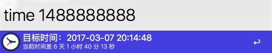

# Alfred Workflows TimeStamp

随手写的小东西，没想到还有不少人在用,所以重新整理了一下。如果有问题请在 Issues 中联系我。
[请到这里下载 Timestamp.alfredworkflow](https://github.com/WiconWang/Alfred-Workflows-TimeStamp/releases)  下载后双击导入即可。

### 说明：
1. 需求软件Alfred.
1. 此 workflows 可以转换时间与时间戳，支持了毫秒级时间戳， 同时显示与当前时间的差

### 命令
1. time now 	   
显示当前时间、时间戳、毫秒时间戳

2. time 1488888888 
时间戳转为时间，同时显示与当前时间的距离。支持毫秒时间戳

3. time 2017-03-07 20:14:48
时间转为时间戳，对时间格式要求不严谨

可以手动更新 TimeStamp文件以更改时区，默认 Asia/Shanghai

### 效果

